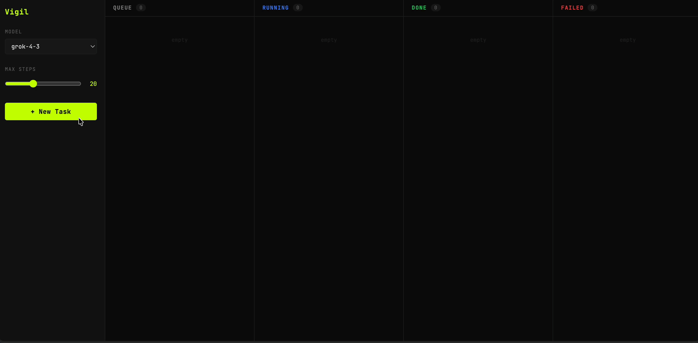

# Vigil



An LLM-driven browser agent that uses the Venice API to complete tasks in a headless Chromium browser via Playwright. Includes a full-stack web dashboard with a Kanban board, live screenshot streaming, markdown reports, and cookie-based account management.

## Setup

```bash
pip install -r requirements.txt
playwright install chromium
cp .env.example .env   # then add your VENICE_API_KEY
```

## Run

```bash
python app.py
# open http://localhost:5000
```

Or run the agent directly from the terminal (no UI):

```bash
python agent.py
```

## Web Dashboard

The dashboard at `http://localhost:5000` provides:

- **Kanban board** — 5 columns: Queue, Running, Paused, Done, Failed
- **New Task modal** — choose model, max steps, optional account, and describe the task
- **Task detail panel** — click any card to open a slide-in panel with:
  - Full action history with timestamps
  - Live browser screenshot (updates every 500ms via SocketIO)
  - Markdown report (if the agent returned one), with a Copy button
  - Stop button (running/paused tasks) and Retry button (failed tasks)
- **Parallel execution** — up to 2 tasks run simultaneously; the rest queue
- **Drag to re-queue** — drag a Failed card onto the Queue column to retry
- **Accounts** — save cookies per domain so the agent can access authenticated sites without seeing your password
- **Take the Wheel** — pause a running task and take direct control of the browser mid-task (see below)

## Take the Wheel

Take the Wheel lets you pause the agentic loop and control the browser yourself, then hand it back to the agent from wherever you left it. The pause can be triggered by you or by the agent.

### User-initiated pause

1. Start a task as normal — it appears in the **Running** column
2. Click **Take the Wheel** on the card (or open the task detail panel and click the button in the footer)
3. The agent finishes its current action, then pauses — the card moves to the **Paused** column and the detail panel shows a **MANUAL CONTROL** badge on the live screenshot
4. Interact with the browser directly:
   - **Click** anywhere on the screenshot to click that position in the browser
   - **Scroll** the screenshot with your mouse wheel to scroll the page
   - **Type** in the keyboard bar below the screenshot to send keystrokes; special keys (Enter, Backspace, Arrow keys, Tab, Escape) work as expected
5. When you're done, click **Give Back Control** — the agent takes a fresh screenshot of the current browser state and resumes the loop from exactly where the browser is

### Agent-initiated handoff

The agent can request a handoff itself when it hits something a human must handle. It emits:

```json
{"action": "handoff", "reason": "Login form detected — please sign in and then give back control"}
```

When this happens:
- The task moves to **Paused** the same way a user-initiated pause does
- An amber **"Agent needs your help"** banner appears at the top of the detail panel showing the agent's reason
- You interact with the browser normally, then click **Give Back Control**
- The agent takes a fresh screenshot and continues from the current browser state — it does not re-attempt the step that triggered the handoff

The agent uses `handoff` (rather than failing) for situations like:
- Login forms and SSO flows
- CAPTCHAs
- Two-factor authentication prompts
- Confirmation dialogs where it shouldn't decide for you
- Ambiguous instructions that need clarification mid-task

### Pause lifecycle

```
queue → running → paused ⇄ running → done / failed
               ↑ user or agent
```

Clicking **Stop** while paused terminates the task (it moves to Failed). A pause only ever takes effect between steps — the agent always finishes its current action first.

### Implementation notes

Take the Wheel is built entirely on Playwright's native input APIs (`page.mouse`, `page.keyboard`) and the existing screenshot stream — no VNC server, no virtual display, and no extra system packages are required. The browser stays headless throughout; the interactive screenshot in the dashboard is the live view.

| Mechanism | How it works |
|-----------|-------------|
| User pause | `_pause_flag` dict set by `pause_task` SocketIO event, checked at top of each loop iteration |
| Agent handoff | `{"action": "handoff"}` detected in the loop after the LLM call, same wait/resume path |
| Wait for resume | `asyncio.run_in_executor` blocks a thread-pool thread, keeping the event loop (and screenshot stream) free |
| Mouse input | `browser_mouse` SocketIO event → `asyncio.run_coroutine_threadsafe` → `page.mouse.click(x, y)` |
| Keyboard input | `browser_key` SocketIO event → `page.keyboard.type(text)` or `page.keyboard.press(key)` |
| Stop while paused | Sets `abort` flag + calls `resume_event.set()` to unblock the waiting thread cleanly |

## How it works

1. Takes a screenshot of the current browser state
2. Sends the screenshot + task + step history to the LLM
3. LLM returns a single JSON action
4. Action is executed in Playwright
5. A background stream captures screenshots every 500ms and pushes them to the UI via `screenshot_update` SocketIO events
6. Repeat until `{"action": "done"}`, `{"action": "report", "text": "..."}`, or max steps is reached

## Account / Cookie Management

Vigil can inject saved cookies before a task starts so the browser is already logged in — your password is never shared with the AI.

1. Log in to the target site in your regular browser
2. Export cookies as JSON using [Cookie-Editor](https://cookie-editor.com) or EditThisCookie
3. Open **Accounts** in the Vigil sidebar, paste the JSON, and save
4. When creating a task, pick the account from the **Account** dropdown

Cookies are stored locally at `./data/cookies/{domain}.json` and are excluded from git. After each task, any refreshed session tokens are written back automatically.

### Cookie API

| Method | Path | Description |
|--------|------|-------------|
| `GET` | `/cookies` | List saved domains |
| `POST` | `/cookies/{domain}` | Save cookies for a domain (JSON array body) |
| `DELETE` | `/cookies/{domain}` | Remove cookies for a domain |

## File Structure

```
├── app.py           — Flask + SocketIO server, task lifecycle, cookie API, pause/resume handlers
├── agent.py         — agentic loop, run_agent_with_callbacks (pause flag, resume event)
├── browser.py       — Playwright wrapper, screenshot stream, coordinate click/keyboard input
├── llm.py           — Venice API client (async, thread-executor)
├── actions.py       — action dispatcher
├── cookies.py       — JSON cookie store (./data/cookies/)
├── config.py        — loads .env
├── templates/
│   └── index.html   — Kanban dashboard (vanilla JS + SocketIO, Take the Wheel UI)
├── data/            — local storage, gitignored
│   └── cookies/     — per-domain cookie files
├── .env.example
└── requirements.txt
```

## Available actions

| Action       | Fields                           | Terminal |
|--------------|----------------------------------|----------|
| `navigate`   | `url`                            |          |
| `click`      | `selector`                       |          |
| `type`/`fill`| `selector`, `text`               |          |
| `scroll`     | `direction` (`up`/`down`)        |          |
| `wait`       | `ms`                             |          |
| `extract`    | `selector`, `description`        |          |
| `screenshot` | _(no fields — retakes snapshot)_ |          |
| `done`       | `result`                         | yes      |
| `report`     | `text` (markdown string)         | yes      |
| `handoff`    | `reason`                         | yes*     |

`report` is preferred over `done` when the task has textual output to show (summaries, research results, scraped data, etc.). The markdown is rendered in the task detail panel.

`handoff` is a soft terminal — the loop pauses and waits for the user to take over, then resumes after control is returned. See [Take the Wheel](#take-the-wheel).

## Supported models (Venice API)

- `grok-4-3`
- `gemini-3-5-flash`
- `claude-opus-4-8`
- `qwen3-coder-480b-a35b-instruct-turbo`

## Config

Edit `config.py` or set env vars:

- `VENICE_API_KEY` — your Venice API key
- `MAX_STEPS` — default max loop iterations (default 20)
